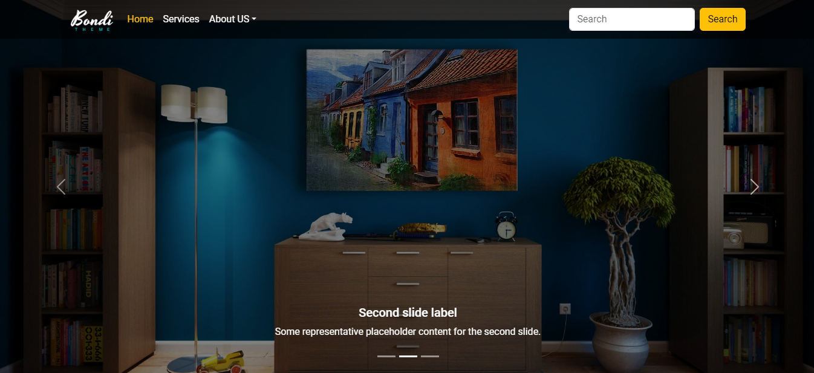

# Bootstrap5 Templates Repository

Welcome to the Bootstrap5 Templates Repository! This repository contains a collection of templates designed to help you kickstart your web development projects. Whether you're building a personal website, a portfolio, or an e-commerce site, you'll find a variety of templates here to suit your needs.

## Table of Contents

1. [Introduction](#introduction)
2. [Features](#features)
3. [Templates](#templates)
    - [Template 1](#template-1)
4. [Contributing](#contributing)
5. [License](#license)

## Introduction

The Bootstrap5 Templates Repository provides ready-to-use templates for web developers and designers. Each template is built using modern HTML5,CSS3 and Bootstrap5 techniques, ensuring high-quality design and functionality. Whether you're building a personal blog, an online portfolio, a corporate website, or an e-commerce store, our templates offer versatile solutions tailored to various industries and use cases.

## Features

- **Responsive**: All templates are fully responsive, ensuring optimal viewing experiences across a wide range of devices, from desktops to smartphones.

- **Cross-Browser Compatibility**: We utilize Normalize.css to ensure consistent rendering across different browsers, providing a seamless user experience for all visitors, also use prefixes for CSS properties that are not fully supported in all browsers.

- **Use of Libraries**: Our templates leverage popular libraries such as Font Awesome and Google Fonts to enhance design flexibility and typography options.

- **Bootstrap 5 Integration**: We utilize Bootstrap 5 framework to provide powerful and flexible layout and design components, streamlining development and ensuring compatibility with the latest web standards.

## Templates

### Templates Navigation

| Template Name | Repository Link              | Demo Link                                                      |
|---------------|------------------------------|----------------------------------------------------------------|
| Template 1    | [Link](Template%20One)       | [Demo](https://seifabdal-azem.github.io/BootStrap-Template01/) |

### Template 1

The project offers a versatile and modern website template designed to cater to a wide range of needs. With its sleek design and intuitive layout, this template is perfect for businesses, agencies, freelancers, or individuals looking to establish a strong online presence.

#### Key Features

1. **Banner with Transition Images**: The template features a captivating banner section with transition images, providing an eye-catching visual experience for visitors.

2. **Services Section**: Showcase your services effectively with a dedicated section highlighting key offerings and features.

3. **Portfolio Gallery**: Display your portfolio with style using the portfolio gallery section, allowing visitors to browse through your work and projects effortlessly.

4. **About Us Page**: Introduce your company or team with the about us page, providing insight into your background, values, and mission.

5. **Team Showcase**: Highlight your team members and their roles with the team showcase section, fostering trust and credibility among visitors.

6. **Sponsors Section**: Acknowledge your sponsors or partners with a dedicated section, demonstrating your commitment to collaboration and support.

7. **Blogs**: Share valuable insights, updates, or industry news with the built-in blog functionality, engaging visitors and encouraging repeat visits.

8. **Frequently Asked Questions (FAQ)**: Address common queries or concerns with an FAQ section, providing helpful answers and improving user experience.

#### Used Componenets

- **Cards**: Example - Images - Horizontal.
- **Accordion**: Example
- **Carousal**: Captions
- **Collapse**: Example
- **Navbar**: Scrolling
- **OffCanvas**: Placement "toogle top"
- **Validation**: Custom Style

#### Used Classes

- **row-cols-auto**: normal .col-* classes apply to the individual columns (e.g., .col-md-4), the row columns classes are set on the parent .row as a shortcut. With .row-cols-auto you can give the columns their natural width.
- **row**: use in parent to make grid layout.
- **col**: apply on the child to define its size.
- **gap classes**: gap-4 - gap-3 - row-gap-3.
- **bg-dark: add dark background.
- **text-white**
- **padding classes**: px "makes padding 0 in x-axis" - p-4
- **margin classes**: mt - mb - mx-auto
- **display classes**: "d-flex"
- **Justify content classes**: "justify-content-center - justify-content-between"
- **border-raduis classes**: rounded-circle - rounded - rounded-bottom
- **text-alignment classes**: text-center
- **positions classes**: position-relative - position-fixed - position-absolute
- **text-transform classes**: text-uppercase
- **border-classes**: border-bottom
- **width and height classes**: w-100 - h-50 - w-50 - h-100 - vh-100
- **z-index classes**: z-3
- **object-fit classes**: object-fit-cover
- **overflow classes**: overflow-y-hidden - overflow-hidden
- **background-colors**: bg-warning.bg-gradient - bg-dark - bg-secondary-subtle
- **shadows class**: shadow-none
- **wrap classes**: flex-nowrap - flex-wrap
- **font-size classes**: fs-1 - fs-3
- **line-height classes**: lh-lg

#### Reference

<https://www.youtube.com/watch?v=9mdGUKFu5OQ&list=PLDoPjvoNmBAyvm7f--dc6XqkpfDcen_vQ>

#### Folder Structure

```css
Template One/
│
├── index.html
|
├── Assets/
│ │ └── css/
│ │     └── main.css
│ │     └── all.min.css
│ │     └── normalize.css
│ │     └── bootstrap.min.css
│ │ └── js/
│ │     └── app.js
│ │     └── all.min.js
│ │     └── bootstrap.bundle.min.js
│ │ └── webfonts/
│ │ └── imgs/
```



[Live Demo](https://seifabdal-azem.github.io/BootStrap-Template01/)

## Contributing

Contributions to this repository are welcome! If you have additional templates to contribute or improvements to existing ones, please follow the guidelines outlined in the [CONTRIBUTING.md](CONTRIBUTING.md) file.

## License

This repository is licensed under the [MIT License](LICENSE). Feel free to use the templates for personal or commercial projects.

Happy coding!
