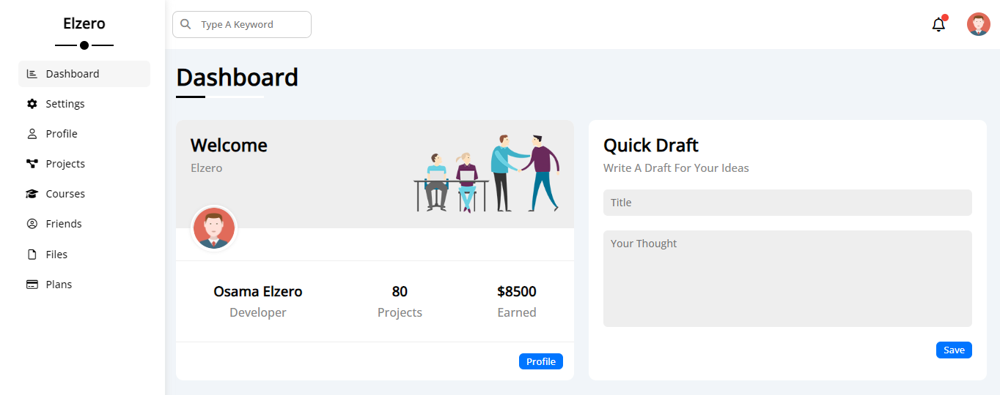

# HTML5 and CSS3 Templates Repository

Welcome to the HTML5 and CSS3 Templates Repository! This repository contains a collection of templates designed to help you kickstart your web development projects. Whether you're building a personal website, a portfolio, or an e-commerce site, you'll find a variety of templates here to suit your needs.

## Table of Contents

1. [Introduction](#introduction)
2. [Features](#features)
3. [Templates](#templates)
    - [Template 1](#template-1)
    - [Template 2](#template-2)
    - [Template 3](#template-3)
    - [Template 4](#template-4)
    - [Template 5](#template-5)
4. [Contributing](#contributing)
5. [License](#license)

## Introduction

The HTML5 and CSS3 Templates Repository provides ready-to-use templates for web developers and designers. Each template is built using modern HTML5 and CSS3 techniques, ensuring high-quality design and functionality. Whether you're building a personal blog, an online portfolio, a corporate website, or an e-commerce store, our templates offer versatile solutions tailored to various industries and use cases.

## Features

- **Responsive**: All templates are fully responsive, ensuring optimal viewing experiences across a wide range of devices, from desktops to smartphones.

- **Animations**: Enhance user engagement with subtle animations throughout the template. From smooth transitions between sections to interactive hover effects, animations add a touch of dynamism to your website.

- **Cross-Browser Compatibility**: We utilize Normalize.css to ensure consistent rendering across different browsers, providing a seamless user experience for all visitors, also use prefixes for CSS properties that are not fully supported in all browsers.

- **Use of Libraries**: Our templates leverage popular libraries such as Font Awesome and Google Fonts to enhance design flexibility and typography options.

- **Gulp Automation**: Gulp is used to automate repetitive tasks in the development workflow, such as compiling SASS files into CSS, optimizing images, and minifying JavaScript files. This streamlines the development process and ensures efficient production of the templates.

- **SASS Preprocessing**: SASS (Syntactically Awesome Style Sheets) is utilized as a preprocessor scripting language for CSS. It provides advanced features such as variables, mixins, and nesting, allowing for more maintainable and organized stylesheets.

- **Pug Templating**: Pug (formerly known as Jade) is used as a template engine for HTML. It simplifies the process of writing HTML by allowing for the use of variables, loops, conditionals, and includes directly within the markup. This improves code readability and maintainability, reducing duplication and errors.

## Templates

### Templates Navigation

| Template Name | Repository Link              | Demo Link                                                         |
|---------------|------------------------------|-------------------------------------------------------------------|
| Template 1    | [Link](Template%20One)       | [Demo](https://seifabdal-azem.github.io/HTML-CSS-Template01/)     |
| Template 2    | [Link](Template%20Two)       | [Demo](https://seifabdal-azem.github.io/HTML-CSS-Template02/)     |
| Template 3    | [Link](Template%20Three)     | [Demo](https://seifabdal-azem.github.io/HTML-CSS-Template03/)     |
| Template 4    | [Link](Template%20Four)      | [Demo](https://seifabdal-azem.github.io/HTML-CSS-Template04/)     |
| Template 5    | [Link](Template%20Five)      | [Demo](https://seifabdal-azem.github.io/Pug-SASS-Templat01/dist/) |

### Template 1

Description: This responsive template offers a comprehensive set of sections designed to showcase your business or personal portfolio effectively. It includes dedicated sections for services, portfolio items, an about section to highlight your background or company information, and a contact section for easy communication. Each section is carefully crafted to ensure a seamless user experience across all devices.

#### Template One Reference

<https://www.youtube.com/watch?v=MBq8ZFEIIaQ&list=PLDoPjvoNmBAzHSjcR-HnW9tnxyuye8KbF>

#### Template One Folder Structure

```css
Template One/
│
├── index.html
|
├── Assets/
│ │ └── css/
│ │     └── main.css
│ │     └── all.min.css
│ │     └── normalize.css
│ │     └── myFrameWork.css
│ │     └── style-guide.md
│ │ └── webfonts/
│ │ └── imgs/
│ │
```


[Live Demo](https://seifabdal-azem.github.io/HTML-CSS-Template01/)

### Template 2

Description: This responsive template offers a comprehensive set of sections designed to showcase your business or personal portfolio effectively. It includes dedicated sections for services, portfolio items, team members, clients, an about section to highlight your background or company information, and a contact section for easy communication. Each section is carefully crafted to ensure a seamless user experience across all devices.

#### Template Two Folder Structure

```css
Template Two/
│
├── index.html
|
├── css/
│ │   └── main.css
│ │   └── all.min.css
│ │
├── js/
│ │   └── custom.js
│ │   └── all.min.js
│ │
├── img/
├── font/
```


[Live Demo](https://seifabdal-azem.github.io/HTML-CSS-Template02/)

### Template 3

Description: This responsive template offers a comprehensive set of sections designed to showcase your business or personal portfolio effectively. It includes dedicated sections for services, portfolio items, an about section to highlight your background or company information, as well as stats, testimonials, and pricing plans to provide additional depth and credibility to your offerings. Additionally, the template incorporates subtle animations throughout to enhance user engagement. A contact section is also included for easy communication. Each section is carefully crafted to ensure a seamless user experience across all devices.

#### Template Three Reference

<https://www.youtube.com/watch?v=7_USXxmn7DM&list=PLDoPjvoNmBAy1l-2A21ng3gxEyocruT0t>

#### Template Three Folder Structure

```css
Template Three/
│
├── index.html
|
├── Assets/
│ │ └── css/
│ │     └── main.css
│ │     └── all.min.css
│ │     └── normalize.css
│ │     └── my-frameWork.css
│ │     └── style-guide.md
│ │
│ │ └── webfonts/
│ │ └── imgs/
│ │ └── media/
│ │
```


[Live Demo](https://seifabdal-azem.github.io/HTML-CSS-Template03/)

### Template 4

Description: This responsive template offers a comprehensive set of sections designed to showcase your business or personal portfolio effectively. It includes dedicated sections for services, portfolio items, articles, gallery, features, testimonials, pricing plans, team members, our skills, how it works, latest events, top videos, and a request a discount feature to provide a complete and engaging user experience. Additionally, the template incorporates subtle animations throughout to enhance user engagement. A contact section is also included for easy communication. Each section is carefully crafted to ensure a seamless user experience across all devices.

#### Template Four Reference

<https://www.youtube.com/watch?v=lXVP3rDH9EU&list=PLDoPjvoNmBAxuCSp2_-9LurPqRVwketnc>

#### Template Four Folder Structure

```css
Template Four/
│
├── index.html
|
├── Assets/
│ │ └── CSS/
│ │     └── main.css
│ │     └── all.min.css
│ │     └── normalize.css
│ │     └── my-frameWork.css
│ │     └── responsive.css
│ │     └── style-guide.md
│ │
│ │ └── JS/
│ │     └── app.js
│ │
│ │ └── webfonts/
│ │ └── imgs/
│ │
```


[Live Demo](https://seifabdal-azem.github.io/HTML-CSS-Template04/)

### Template 5

Description: This responsive template offers a comprehensive set of sections and pages designed to cater to various needs. It includes dedicated sections for yearly targets, latest events, latest news, top search items and other sections to provide a complete and engaging user experience. Additionally, the template includes pages for dashboard, settings, profile, projects, courses, friends, files, and pricing plans, ensuring versatility and functionality for different types of websites or web applications. Subtle animations are incorporated throughout to enhance user engagement, and a contact section is also included for easy communication. Each section and page is carefully crafted to ensure a seamless user experience across all devices.

#### Template Five Reference

<https://www.youtube.com/watch?v=4OGWPn-Q__I&list=PLDoPjvoNmBAyGaRGzPVZCkYx5L7Mo9Tbh>

### Tools Used

- **Pug**: A template engine for Node.js that simplifies writing HTML by allowing you to include variables, loops, conditionals, and other features directly in your markup.
- **SASS**: A preprocessor scripting language that is interpreted or compiled into CSS. It provides more features and flexibility than traditional CSS, such as variables, mixins, nesting, and inheritance.
- **Gulp**: A task runner built on Node.js that automates repetitive tasks in your development workflow, such as compiling SASS, compiling pug, compress project, and more.

### Compiling Pug in My Project

In my project, I experimented with various methods to compile Pug files into HTML. Here's a summary of my journey:

#### 1. Compile Hero Extension

Initially, I tried using the Compile Hero extension, which provides a convenient way to compile Pug files directly within my code editor. While this method was easy to set up and use, I found it somewhat limited in terms of customization and control over the compilation process.

#### 2. Pugjs Package

Next, I explored using the `pugjs` package, a JavaScript implementation of the Pug template engine. I integrated `pugjs` directly into my project and used it to compile Pug files programmatically. This approach gave me more flexibility and control over the compilation process compared to the Compile Hero extension. However, I found it somewhat cumbersome to manage dependencies and configuration settings manually.

#### 3. Pugjs CLI Package

As an alternative to the JavaScript implementation, I also experimented with the `pugjs-cli` package, which provides a command-line interface (CLI) for compiling Pug files. This allowed me to compile Pug files from the terminal using simple commands, which was convenient for automating the compilation process in my development workflow.

#### 4. Gulp Task

Finally, I settled on using Gulp as my preferred method for compiling Pug files. I created a Gulp task that automatically compiles Pug files into HTML as part of my build process. This approach provided a seamless integration with my existing Gulp-based workflow and offered extensive customization options through Gulp plugins.

Overall, my journey of compiling Pug in my project involved experimenting with different tools and techniques to find the most efficient and effective solution for my needs. Through this process, I gained valuable insights into the capabilities and trade-offs of each method, ultimately leading me to choose Gulp as my preferred approach.

#### Template Five Folder Structure

```css
Template Five/
│
├── src/
│ │ └── pug/
│ │     └── index.pug
│ │     └── settings.pug
│ │     └── ...
│ │
│ │ └── sass/
│ │     └── main.scss
│ │     └── helpers/
│ │     └── layout/
│ │     └── pages/
│ │     └── components/
│ │
├── dist/
│ │ └── css/
│ │     └── main.css
│ │     └── main.css.map
│ │     └── all.min.css
│ │     └── normalize.css
│ │     └── myFrameWork.css
│ │     └── style-guide.md
│ │
│ │ └── Assets/
│ │     └── design layout/
│ │     └── imgs/
│ │
│ │ └── webfonts/
│ │ └── index.html
│ │ └── courses.html
│ │ └── ...
│ │
├── node_modules/
├── gulpfile.mjs
├── package.json
├── package-lock.json
│ │
```



[Live Demo](https://seifabdal-azem.github.io/Pug-SASS-Templat01/dist/)

## Contributing

Contributions to this repository are welcome! If you have additional templates to contribute or improvements to existing ones, please follow the guidelines outlined in the [CONTRIBUTING.md](CONTRIBUTING.md) file.

## License

This repository is licensed under the [MIT License](LICENSE). Feel free to use the templates for personal or commercial projects.

Happy coding!
