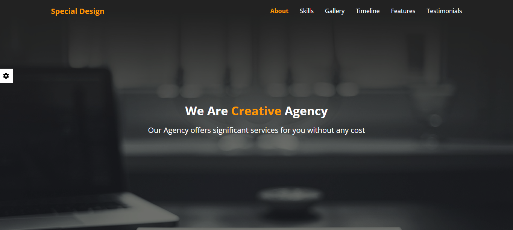

# HTML5, CSS3 and JS Templates Repository

Welcome to the HTML5, CSS3 and JS Templates Repository! This repository contains a collection of templates designed to help you kickstart your web development projects. Whether you're building a personal website, a portfolio, or an e-commerce site, you'll find a variety of templates here to suit your needs.

## Table of Contents

1. [Introduction](#introduction)
2. [Features](#features)
3. [Templates](#templates)
    - [Template 1](#template-1)
4. [Contributing](#contributing)
5. [License](#license)

## Introduction

The HTML5, CSS3 and JS Templates Repository provides ready-to-use templates for web developers and designers. Each template is built using modern HTML5, CSS3 and JS techniques, ensuring high-quality design and functionality. Whether you're building a personal blog, an online portfolio, a corporate website, or an e-commerce store, our templates offer versatile solutions tailored to various industries and use cases.

## Features

- **Responsive**: All templates are fully responsive, ensuring optimal viewing experiences across a wide range of devices, from desktops to smartphones.

- **Cross-Browser Compatibility**: We utilize Normalize.css to ensure consistent rendering across different browsers, providing a seamless user experience for all visitors, also use prefixes for CSS properties that are not fully supported in all browsers.

- **Use of Libraries**: Our templates leverage popular libraries such as Font Awesome and Google Fonts to enhance design flexibility and typography options.

## Templates

### Templates Navigation

| Template Name | Repository Link              | Demo Link                                               |
|---------------|------------------------------|---------------------------------------------------------|
| Template 1    | [Link](Template%20One)       | [Demo](https://seifabdal-azem.github.io/JS-Template01/) |

### Template 1

The template is a comprehensive and versatile website solution designed to elevate your online presence with ease. With a sleek design and intuitive user interface, this template caters to a wide range of needs, making it suitable for businesses, agencies, freelancers, or individuals looking to establish a strong and dynamic online presence.

#### Key Sections

1. **About Us**: Introduce your company or team with a dedicated section that provides insights into your background, values, and mission.

2. **Our Skills**: Showcase your expertise and capabilities with an interactive section highlighting your team's skills and qualifications.

3. **Our Gallery**: Display your work and projects in style with a gallery section, allowing visitors to browse through your portfolio effortlessly.

4. **Timeline**: Tell your story or showcase your journey with a timeline section, providing a visual representation of key milestones and achievements.

5. **Features**: Highlight the key features and offerings of your products or services with a feature-rich section that captivates and informs visitors.

6. **Testimonials**: Build trust and credibility with potential customers by showcasing testimonials from satisfied clients or customers.

7. **Contact Us**: Make it easy for visitors to get in touch with you by including a contact form or contact details in a dedicated section.

#### Advanced Features

- **Color Theme Settings**: Customize the color theme of your website to match your brand or preferences with the built-in settings option.

- **Background Random Generator**: Keep your website fresh and engaging with a background random generator in the banner section, providing dynamic visuals for visitors.

- **Navigation Bullets**: Choose whether to show or hide navigation bullets for a seamless and customizable browsing experience.

- **Multilingual Support**: Enhance accessibility and reach by offering website translation into Arabic and English, allowing visitors to switch languages interchangeably.

#### Technology Stack

- **HTML5**: Utilizing the latest HTML5 markup for semantic structure and accessibility.
- **SASS**: Leveraging SASS (Syntactically Awesome Style Sheets) for efficient CSS development with variables, mixins, and more.
- **JavaScript**: Incorporating JavaScript for dynamic interactions and enhanced user experiences.

#### Reference

<https://www.youtube.com/watch?v=vedT2jk3hi4&list=PLDoPjvoNmBAzvmpzF-6l3tAviiCPbwkB8>

#### Folder Structure

```css
Template One/
│
├── index.html
|
├── Assets/
│ │ └── css/
│ │     └── main.css
│ │     └── all.min.css
│ │     └── normalize.css
│ │     └── colors.css
│ │     └── style-guide.md
│ │ └── js/
│ │     └── app.js
│ │     └── all.min.js
│ │     └── translations.json
│ │ └── webfonts/
│ │ └── imgs/
│ │
├── SASS/
```



[Live Demo](https://seifabdal-azem.github.io/JS-Template01/)

## Contributing

Contributions to this repository are welcome! If you have additional templates to contribute or improvements to existing ones, please follow the guidelines outlined in the [CONTRIBUTING.md](CONTRIBUTING.md) file.

## License

This repository is licensed under the [MIT License](LICENSE). Feel free to use the templates for personal or commercial projects.

Happy coding!
