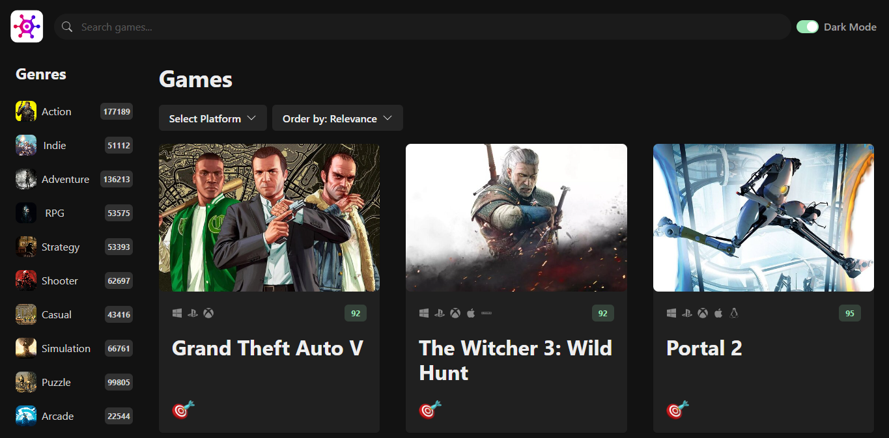

# React Templates Repository

## Table of Contents

1. [Introduction](#introduction)
2. [Features](#features)
3. [Templates](#templates)
    - [Template 1](#template-1)
4. [How to use it](#how-to-use-it)
5. [Contributing](#contributing)
6. [License](#license)

## Introduction

Welcome to the React Templates Repository! This repository contains a collection of React templates for building various web applications. Whether you're a beginner looking to learn React or a seasoned developer in need of inspiration, this repository has something for everyone.

## Features

- **Responsive**: All templates are fully responsive, ensuring optimal viewing experiences across a wide range of devices, from desktops to smartphones.

- **Use of Libraries**: Our templates leverage popular libraries such as React Icons and Chakra UI for creating user interfaces.

- **API Integration**: Uses Axios for fetching APIs.

- **State Management**: Implements state management for managing application data.

## Templates

### Templates Navigation

| Template Name | Repository Link              | Demo Link                                     |
|---------------|------------------------------|-----------------------------------------------|
| Template 1    | [Link](Template%20One)       | [Demo](https://game-hub-gules-pi.vercel.app/) |

### Template 1

Template 1 is a game-hub website that displays various games. Users can filter games by genres list or platform, sort them by name, date added, or popularity, search for specific games, and switch between light and dark modes.

#### Key Components

- Filtering
- Sorting
- Searching Input
- Dark Mode Switcher
- Game Grid
- Game Card

#### Technology Stack

- **React**: A JavaScript library for building user interfaces.
- **Axios**: A promise-based HTTP client for making API requests.
- **Chakra UI**: A simple, modular, and accessible component library for React applications.
- **React Icons**: A collection of icons for React applications.
- **Vercel**: A cloud platform for deploying serverless functions and static websites.

#### Reference

<https://codewithmosh.com/p/ultimate-react-part1>

#### Folder Structure

```css
Template One/
│
├── index.html
|
├── public/
├
├── src/
│ │ └── assets/
│ │ └── components/
│ │ └── data/
│ │ └── hooks/
│ │ └── Services/
│ │ └── Theme/
│ │ └── App.tsx
│ │ └── main.tsx
│ │
```



[Live Demo](https://game-hub-gules-pi.vercel.app/)

## How to Use It

To utilize Template 1 from this repository, follow these steps:

1. **Install Dependencies**: Begin by installing the necessary dependencies. Run the command `npm i` in your terminal to install them automatically.

2. **Set API Key**: After installing the dependencies, you'll need to set up your API key. Navigate to the Axios instance within the project files and locate the `key` property. Replace the placeholder value with your actual API key. You can obtain an API key by signing up on the RAWG website and generating one from the API section in the navigation bar.

3. **Run Locally**: Once the dependencies are installed and the API key is set, you can run the project locally. Execute the command `npm run dev` in your terminal to start the development server.

Following these steps will allow you to successfully use Template 1 and explore its functionalities locally on your machine.

## Contributing

Contributions to this repository are welcome! If you have additional templates to contribute or improvements to existing ones, please follow the guidelines outlined in the [CONTRIBUTING.md](CONTRIBUTING.md) file.

## License

This repository is licensed under the [MIT License](LICENSE). Feel free to use the templates for personal or commercial projects.

Happy coding!
