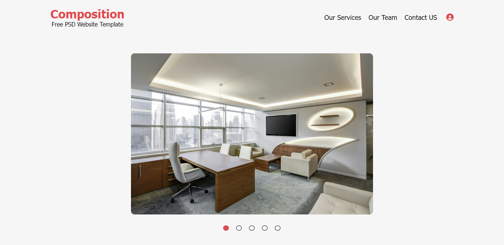
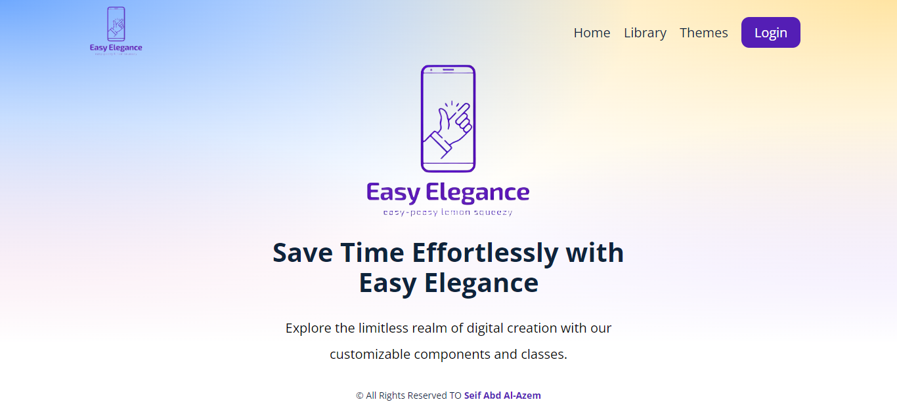

# SASS Templates Repository

Welcome to the SASS Templates Repository! This repository contains a collection of templates designed to help you kickstart your web development projects. Whether you're building a personal website, a portfolio, or an e-commerce site, you'll find a variety of templates here to suit your needs.

## Table of Contents

1. [Introduction](#introduction)
2. [Features](#features)
3. [Templates](#templates)
    - [Template 1](#template-1)
    - [Template 2](#template-2)
4. [Contributing](#contributing)
5. [License](#license)

## Introduction

The SASS Templates Repository provides ready-to-use templates for web developers and designers. Each template is built using modern SASS techniques, ensuring high-quality design and functionality. Whether you're building a personal blog, an online portfolio, a corporate website, or an e-commerce store, our templates offer versatile solutions tailored to various industries and use cases.

## Features

- **Responsive**: All templates are fully responsive, ensuring optimal viewing experiences across a wide range of devices, from desktops to smartphones.

- **Cross-Browser Compatibility**: We utilize Normalize.css to ensure consistent rendering across different browsers, providing a seamless user experience for all visitors, also use prefixes for CSS properties that are not fully supported in all browsers.

- **Use of Libraries**: Our templates leverage popular libraries such as Font Awesome and Google Fonts to enhance design flexibility and typography options.

- **SASS Integration**: Leveraging the power of SASS (Syntactically Awesome Style Sheets) for efficient CSS development, allowing for variables, mixins, and other advanced features to streamline the styling process.

- **Gulp**: Employing Gulp as a task runner to automate repetitive tasks such as compiling SASS, minifying CSS and JavaScript files, optimizing images, and more.

## Templates

### Templates Navigation

| Template Name | Repository Link              | Demo Link                                                     |
|---------------|------------------------------|---------------------------------------------------------------|
| Template 1    | [Link](Template%20One)       | [Demo](https://seifabdal-azem.github.io/SASS-Template01/)     |
| Template 2    | [Link](Template%20Two)       | [Demo](https://seifabdal-azem.github.io/EasyElegance/dest/)   |

### Template 1

Description: The template is a dynamic and feature-rich website solution designed to showcase your business, portfolio, or personal brand with style and versatility. With a sleek design and intuitive user interface, this template caters to various needs, making it suitable for businesses, agencies, freelancers, or individuals looking to establish a strong online presence.

#### Key Sections

1. **Gallery Slider in the Banner Section**: Capture visitors' attention with a captivating gallery slider in the banner section, providing a visually stunning introduction to your website.

2. **Services**: Highlight your services and offerings effectively with a dedicated section that showcases your expertise and capabilities.

3. **Team**: Introduce your team members and their roles with an interactive team section, fostering trust and credibility among visitors.

4. **Gallery**: Showcase your work and projects in style with a gallery section, allowing visitors to browse through your portfolio effortlessly.

5. **Dynamic Blogs Creation**: Keep your website content fresh and engaging with dynamic blogs creation functionality, allowing you to easily create and publish new blog posts on the fly.

#### Template One Reference

<https://www.youtube.com/watch?v=Di_RlcpkpN4&list=PLDoPjvoNmBAzlpyFHOaB3b-eubmF0TAV2>

#### Folder Structure

```css
Template One/
│
├── index.html
|
├── Assets/
│ │ └── css/
│ │     └── main.css
│ │     └── all.min.css
│ │     └── normalize.css
│ │     └── main.scss
│ │     └── SASS/
│ │     |   └── components/
│ │     |   └── helpers/
│ │     |   └── layout/
│ │     |   └── pages/
│ │ └── js/
│ │     └── app.js
│ │ └── webfonts/
│ │ └── imgs/
```



[Live Demo](https://seifabdal-azem.github.io/SASS-Template01/)

### Template 2

#### Description

The **EasyElegance** is a comprehensive SASS library aimed at providing developers with a robust set of tools and components to streamline the process of building responsive and visually appealing web applications. With a focus on modularity and customization, this library offers flexible solutions for layout, components, and utility classes, empowering developers to create stunning websites with ease.

#### What you will learn from this template

- How to use SCSS.
- How to compile SCSS into CSS code.
- Project Structure
- Partials and Imports
- Variables
- Nested Rules
- Using Math
- Maps
- Loops
- Conditionals (@if)
- Parent Selectors
- Mixins
- Functions
- Making Utility Classes
- Media Queries
- Making a grid System
- Using @extend
- How to use your library
- Purging CSS

#### Key Features

##### Layout

- **Grid System**: Utilize a flexible and customizable grid system for creating responsive layouts with ease. The grid system includes support for breakpoints to ensure optimal viewing experiences across various devices.

##### Components

- **Navbar**: Easily integrate a responsive navigation bar into your web applications with customizable options for branding, navigation links, and dropdown menus.
- **Buttons**: Choose from a variety of button styles and sizes to suit your design needs, with support for hover effects and disabled states.
- **Badges**: Enhance user engagement and visual hierarchy with customizable badge components to highlight important information or notifications.
- **Cards**: Create versatile card components for displaying content, images, and actions with flexible options for styling and layout.

##### Utility Classes

- **Margin and Padding**: Apply consistent spacing to elements using utility classes for margin and padding, with support for responsive modifiers.
- **Opacity**: Control the opacity of elements with utility classes for adjusting transparency levels.
- **Text and Font Properties**: Customize text and font properties such as font size, weight, style, and alignment using utility classes.
- **Colors**: Define a color palette and apply colors to elements using utility classes, with support for text, background, border, and hover states.
- **Border**: Add borders to elements with customizable options for size, style, and color.
- **Display**: Control the display behavior of elements using utility classes for visibility and responsiveness.
- **Positions**: Position elements precisely within the layout using utility classes for absolute and relative positioning.
- **Justify Content**: Align and distribute content within containers using utility classes for flexbox alignment.

##### Themes

- **Theme Customization**: Explore a collection of pre-designed themes or create custom themes using the library's theme customization page. Customize colors, typography, and other design elements to match your brand identity or project requirements.

#### Benefits

- **Modular and Customizable**: Take advantage of modular components and utility classes to build custom layouts and designs tailored to your specific needs.
- **Responsive Design**: Ensure optimal viewing experiences across various devices with responsive layouts and components that adapt to different screen sizes.
- **Consistent Design Language**: Maintain consistency in design and branding across your web applications with predefined styles and themes provided by the library.
- **Efficient Development**: Speed up development time and reduce code duplication by leveraging reusable components and utility classes provided by the library.

#### Usage

Integrate the **EasyElegance** into your web projects by importing the SASS files and customizing the components and utility classes to fit your design requirements. Explore the documentation and examples provided to learn more about the library's features and usage.

Empower your web development workflow with the **EasyElegance**, providing a comprehensive set of tools and components to create modern and responsive web applications with ease.

#### Compilation Tool

- We can't just hook up a SASS file to our html pages; it will not work; so, We need to process SASS into CSS file before it works in a browser to do that we will use a task runner called Gulp.
- First We need to install nodeJs because we will be using npm "node package manager" to install gulp and some plugins into our project.
- To install nodejs We need to go to nodejs.org and click the download button "Recommended to download the current".

#### Why We using Gulp?

- Because, It offers more compilation options including the ability to tree shake or purge any unused styles later on. Also, It allows us to use SASS debug tool which the live SASS compiler doesn't allow at the time being.

#### npm commands

1. "node -v" Write this in terminal in VS code and that will check if we installed npm correctly or not. if it returns the version then it is instlled corectly.

2. “npm init” will create a package.json file and it's going to keep track of all of our project dependecies "the things that we're about to install".

3. "npm install gulp gulp-sass sass --save-dev" (gulp is the tusk runner which will ultimately run our compilation task. gulp-sass  is the sass task plugin for gulp which will compile our SASS code, the SASS package is what the gulp sass plugin will use under the hood. Save dev flag means these packages will be stored in our package.json file as development dependencies)

4. Create gulp file “which is basically JS file contains functions for gulp to run and one of those functions is going to be for compiling our sass to CSS.” (you must write file by this name gulpfile.js).

5. "gulp" write it in terminal to run gulp file (if it doesn't work you can install it globally by using this command "npm install -g gulp" and then type gulp if it still does not work write npx gulp).

- You can enter ctrl + c in terminal to exit the gulp

- There is another plugin that help us to purge the CSS file “production file” (npm install gulp-purgecss --save-dev)

#### Template Two Reference

<https://www.youtube.com/watch?v=_kqN4hl9bGc&list=PL4cUxeGkcC9jxJX7vojNVK-o8ubDZEcNb>

#### Template Two Folder Structure

```css
Template One/
│
├── dest/
│ │ └── css/
│ │     └── main.css
│ │     └── all.min.css
│ │     └── normalize.css
│ │     └── EasyElegance.css
│ │     └── test.css
│ │ └── Assets/
│ │     └── imgs/
│ │ └── js/
│ │     └── all.min.js
│ │     └── app.js
│ │ └── test/
│ │     └── test.html
│ │     └── img/
│ │ └── webfonts/
│ │ └── EasyElegance.html
│ │ └── index.html
│ │ └── themes.html
│ │
│ │
├── src/
│ │ └── EasyElegance/
│ │     └── components/
│ │     └── helpers/
│ │     └── layout/
│ │     └── utilities/
│ │     └── EasyElegance.scss
│ │     └── main.scss
│ │
│ │
├── node_modules/
├── gulpfile.js
├── package.json
├── package-lock.json
```



[Live Demo](https://seifabdal-azem.github.io/EasyElegance/dest/)

## Contributing

Contributions to this repository are welcome! If you have additional templates to contribute or improvements to existing ones, please follow the guidelines outlined in the [CONTRIBUTING.md](CONTRIBUTING.md) file.

## License

This repository is licensed under the [MIT License](LICENSE). Feel free to use the templates for personal or commercial projects.

Happy coding!
